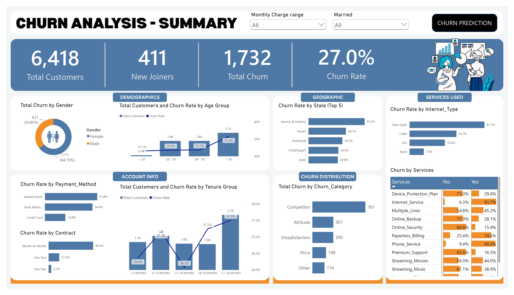
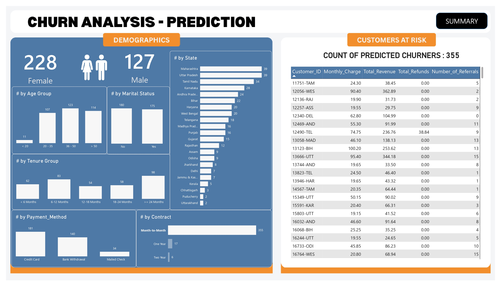

# Customer-Churn-Analysis

An end-to-end data analytics project that analyzes customer churn patterns and predicts future churners using Machine Learning. This project demonstrates the complete analytics workflow from SQL data preparation to Power BI visualization and predictive modeling using Python.

## Live Dashboard

View Interactive Dashboard
https://app.powerbi.com/groups/me/reports/c1d8e1f4-2310-4587-af7e-1566df0674a6/efc3ed6c065e102e5346?experience=power-bi

---

## 🚀 Project Overview

Customer churn is one of the biggest challenges faced by subscription-based businesses. This project aims to identify the factors contributing to customer churn and build a predictive model to identify customers who are likely to leave.

The project covers:

- SQL Data Cleaning & Transformation
- Data Quality Validation
- Power BI Dashboard Development
- Customer Churn Analysis
- Machine Learning Prediction using Random Forest
- Business Insights & Recommendations

---

## 🛠️ Tech Stack

- Microsoft SQL Server
- SQL Server Management Studio (SSMS)
- Power BI Desktop
- Python
- Jupyter Notebook
- Pandas
- NumPy
- Scikit-learn
- Matplotlib

---

## 📂 Project Structure

```
Customer-Churn-Analysis
│
├── Data
│   ├── Customer_Data.csv
│   ├── Prediction_Data.xlsx
│   └── Predictions.xlsx
│
├── SQL
│   ├── Data_Exploration.sql
│   ├── Data_Quality_Check.sql
│   ├── Data_Cleaning_and_Production_Table.sql
│   └── Create_PowerBI_Views.sql
│
├── Power BI
│   ├── Churn Analysis.pbix
│   ├── Churn Analysis Summary.pdf
│   └── Churn Analysis Prediction.pdf
│
├── RF Model
│   ├── Churn_Prediction.ipynb
│   ├── random_forest_model.pkl
│
├── Images
│   ├── summary_dashboard.png
│   └── prediction_dashboard.png
│
├── requirements.txt
│   
└── README.md
```

---

# 📊 Dashboard Preview

## Customer Churn Summary Dashboard




---

## Customer Churn Prediction Dashboard




---

# 📈 Dashboard Features

### Executive Summary

- Total Customers
- New Joiners
- Total Churn
- Churn Rate

### Customer Demographics

- Gender Analysis
- Age Group Analysis
- Marital Status

### Account Information

- Payment Method Analysis
- Contract Analysis
- Monthly Charges
- Customer Tenure

### Geographic Analysis

- State-wise Churn Analysis
- Top 5 States with Highest Churn

### Service Analysis

- Internet Type
- Online Security
- Backup Services
- Streaming Services
- Premium Support
- Device Protection

### Churn Distribution

- Churn Categories
- Churn Reasons

### Churn Prediction Dashboard

- Predicted Churn Customers
- Customer Risk Table
- State-wise Prediction
- Gender Distribution
- Contract Type
- Payment Method
- Age Group
- Marital Status

---

# ⚙️ Project Workflow

```
Customer Dataset
        │
        ▼
SQL Server
(Data Cleaning & Transformation)
        │
        ▼
Production Tables
        │
        ▼
SQL Views
        │
        ▼
Power BI Dashboard
        │
        ▼
Python Machine Learning Model
(Random Forest)
        │
        ▼
Predicted Churn Customers
        │
        ▼
Power BI Prediction Dashboard
```

---

# 🤖 Machine Learning

Algorithm Used:

- Random Forest Classifier

Steps Performed:

- Data Cleaning
- Feature Selection
- Label Encoding
- Train-Test Split
- Model Training
- Model Evaluation
- Future Customer Prediction

---

# 📌 Key Business Insights

- Month-to-Month contract customers have the highest churn rate.
- Customers using Fiber Optic internet services are more likely to churn.
- Customers paying through Mailed Check show a higher churn rate.
- Customers with shorter tenure are more likely to leave.
- Churn prediction enables businesses to identify high-risk customers and take proactive retention measures.

---

# 📁 SQL Scripts

| File | Description |
|------|-------------|
| Data_Exploration.sql | Exploratory analysis on customer data |
| Data_Quality_Check.sql | Identifies missing values across all columns |
| Data_Cleaning_and_Production_Table.sql | Cleans data and creates production table |
| Create_PowerBI_Views.sql | Creates SQL views for Power BI |

---

# 🚀 How to Run the Project

### 1. SQL

- Create the database.
- Import Customer_Data.csv.
- Execute SQL scripts in sequence.

### 2. Power BI

- Open the `.pbix` file.
- Refresh the data.
- Explore the interactive dashboard.

### 3. Machine Learning

Install dependencies

```bash
pip install -r requirements.txt
```

Run

```bash
Churn_Prediction.ipynb
```

The notebook generates customer churn predictions.

---

# 📚 Dataset

The dataset contains customer demographic information, account details, services subscribed, billing information, and churn status.

---

# 🎯 Future Improvements

- Hyperparameter Tuning
- XGBoost Model
- LightGBM Model
- SHAP Explainability
- Streamlit Deployment
- Azure SQL Integration
- Power BI Service Scheduled Refresh

---

## ⭐ If you found this project useful, consider giving it a star!
